# 🛡️ Protecting Production Infrastructure from Accidental CloudFormation Deletion

Accidentally deleting critical infrastructure is not a beginner mistake —  
it's a **real production risk** faced by engineers working with AWS CloudFormation in shared or live environments.

This repository documents a **real-world, practical workflow** to prevent that exact failure mode using native CloudFormation safeguards.

---

## 🚨 Why This Matters (The Real Problem)

By default, AWS CloudFormation tightly couples **stack lifecycle** with **resource lifecycle**.

That means:
- Delete the stack → delete the infrastructure
- No confirmation per resource
- No undo
- No safety net

In production or shared AWS accounts, this can lead to:
- EC2 termination
- Data loss
- Downtime
- Incident response escalations

This project exists to demonstrate how to **break that destructive coupling safely**.

---

## 🎯 What This Repository Demonstrates

This is NOT a theoretical example.

This repository shows a **real, tested workflow**:

1. Create a normal CloudFormation stack
2. Allow infrastructure to be created normally
3. Update the same stack to add retention policies
4. Delete the stack intentionally
5. Infrastructure remains alive and operational

This mirrors **how retention is applied in real organizations**, not toy demos.

---

## 🧠 Core Concept: Retention Policies

Two CloudFormation properties fundamentally change how infrastructure behaves:

```yaml
DeletionPolicy: Retain
UpdateReplacePolicy: Retain
```

These ensure:
- Resources are skipped during stack deletion
- Resources survive update replacements
- Infrastructure remains under your control

---

## 🏗️ Infrastructure in This Demo

- AWS EC2 Instance
- AWS Security Group
- AWS CloudFormation (Console-based workflow)

### Why EC2?

- It is stateful
- It represents real production risk
- Its deletion is irreversible without backups

---

## 📄 CloudFormation Templates Overview

### 🔹 Initial Template (No Retention)

This template represents default CloudFormation behavior.

**Purpose:**
- Create infrastructure normally
- No safeguards applied
- Represents common beginner or default usage

**File:** `template-v1.yml`

---

### 🔹 Updated Template (With Retention Policy)

This version adds protection to the same resources.

**Purpose:**
- Protect infrastructure before stack deletion
- Demonstrates correct production approach

**File:** `template-v2.yml`

---

## 🧭 Step-by-Step Visual Walkthrough

### Step 1️⃣ — Specify Stack Details

Configure the stack name and begin the creation process.

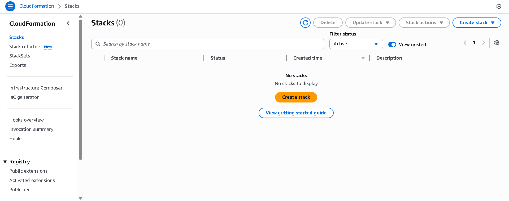

**What's happening:**
- Navigate to AWS CloudFormation > Create Stack
- Specify stack name: `CloudFormation-Demo`
- Stack name must contain only letters, numbers, and hyphens
- Maximum 128 characters

---

### Step 2️⃣ — Create Change Set for Stack Update

After initial stack creation, prepare an update to add retention policies.

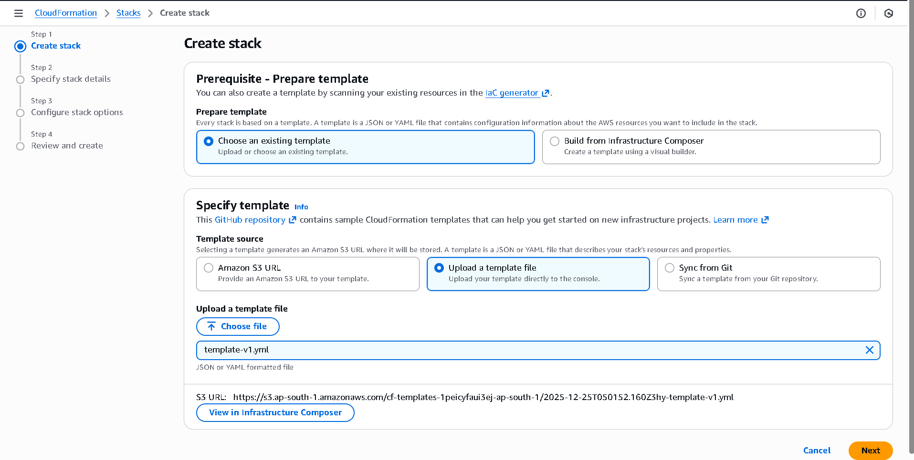

**What's happening:**
- Go back to your created stack
- Click "Update Stack"
- Create a change set to preview changes
- This allows safe review before applying changes

---

### Step 3️⃣ — Change Set Review & Details

Review what will be modified in your stack.

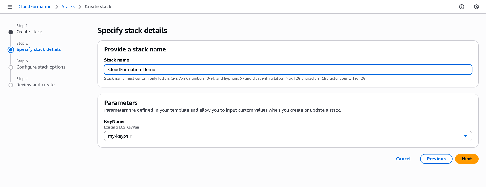

**What's happening:**
- Change set name: `CloudForma-retention`
- Description: "Updated EC2 stack with retention policy"
- Change set type: Standard (normal stack update)
- Status: Shows changes are ready to review

---

### Step 4️⃣ — Stacks Overview (Initial State)

View all CloudFormation stacks with no active stacks.

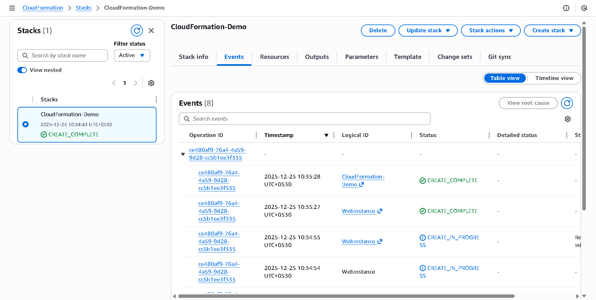

**What's happening:**
- CloudFormation Stacks dashboard
- Stacks (0) — no active stacks yet
- Shows filter options and stack management buttons

---

### Step 5️⃣ — Template Selection & Upload

Choose how to provide your CloudFormation template.

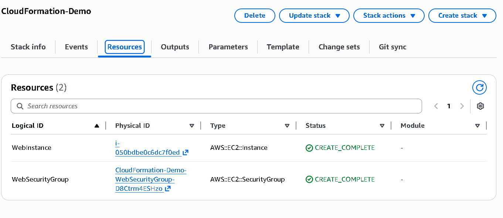

**What's happening:**
- Select "Upload a template file"
- Choose `template-v1.yml` from your computer
- CloudFormation stores it in S3 for processing
- Template is validated before use

---

### Step 6️⃣ — Stack Created Successfully (Events View)

Monitor the stack creation process through events.

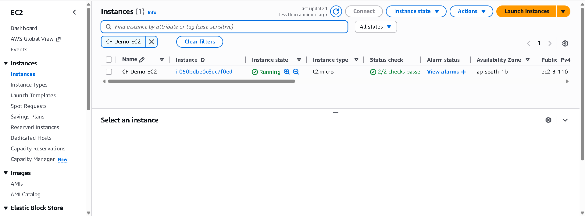

**What's happening:**
- Status: `CREATE_COMPLETE` ✅
- Created time: 2025-12-25 10:34:43 UTC+0530
- Events show creation timeline
- All resources successfully created

---

### Step 7️⃣ — Change Set Execution Options

Choose how to handle stack update failures.


**What's happening:**
- "Roll back all stack resources" is selected
- This reverts to last known stable state on failure
- "Use deletion policy" respects retention settings
- Safe failover behavior configured

---

### Step 8️⃣ — Change Set Details & Name

Specify the change set name and description.

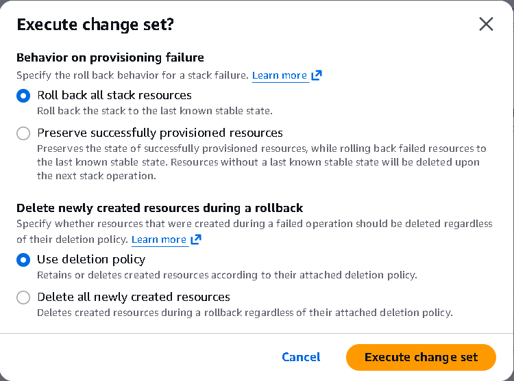

**What's happening:**
- Change set name: `CloudForma-retention`
- Description: "Updated EC2 stack with retention policy"
- This identifies the specific update
- Makes audit trail clear

---

### Step 9️⃣ — Change Set Before Execution

Final review of pending changes.


**What's happening:**
- Shows "Change sets (0)" — no sets pending yet
- "Create change set" button ready
- Change sets allow safe previewing of updates

---

### Step 🔟 — Stack Updated Successfully

Stack update completes with retention policies applied.

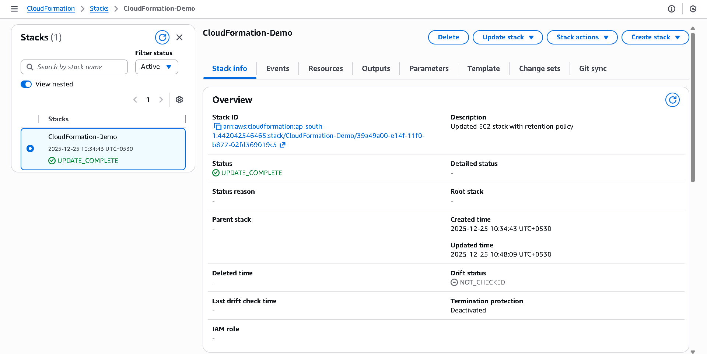

**What's happening:**
- Status: `UPDATE_COMPLETE` ✅
- Updated time: 2025-12-25 10:48:09 UTC+0530
- Events show update timeline
- Stack now has retention policies active

---

### Step 1️⃣1️⃣ — Stack Info Overview (Updated)

View updated stack information and configuration.

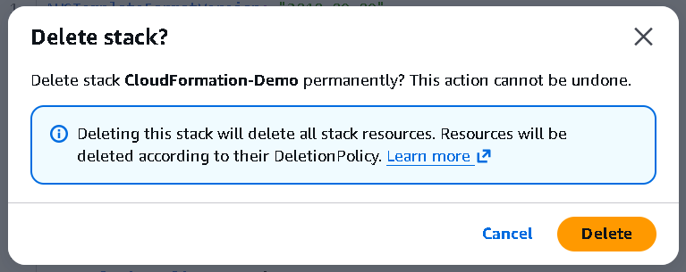

**What's happening:**
- Stack ID shows unique ARN
- Status: `UPDATE_COMPLETE`
- Description: "Updated EC2 stack with retention policy"
- Shows created and updated timestamps

---

### Step 1️⃣2️⃣ — Stacks List (Before Deletion)

Stack visible in the active stacks list.

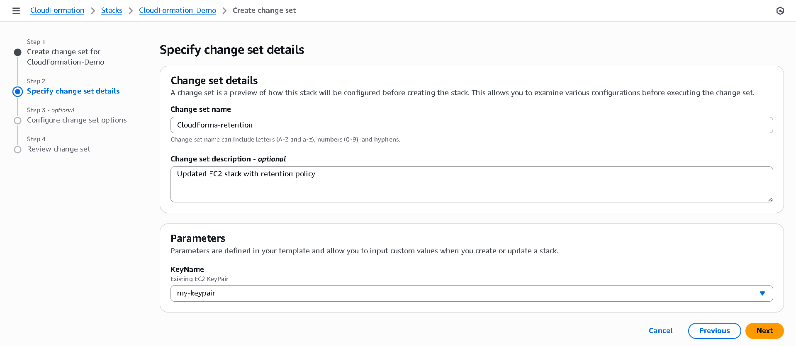

**What's happening:**
- Stack "CloudFormation-Demo" is active
- Status shows `UPDATE_COMPLETE`
- Next step: Delete this stack

---

### Step 1️⃣3️⃣ — Delete Stack Confirmation

Confirmation dialog appears when deleting the stack.


**What's happening:**
- Dialog: "Delete stack CloudFormation-Demo permanently?"
- Warning: "This action cannot be undone"
- Important message: "Resources will be deleted according to their DeletionPolicy"
- Retention policies will keep resources alive
- Click "Delete" to proceed

---

### Step 1️⃣4️⃣ — Stack Deletion in Progress

Stack deletion events showing progress.

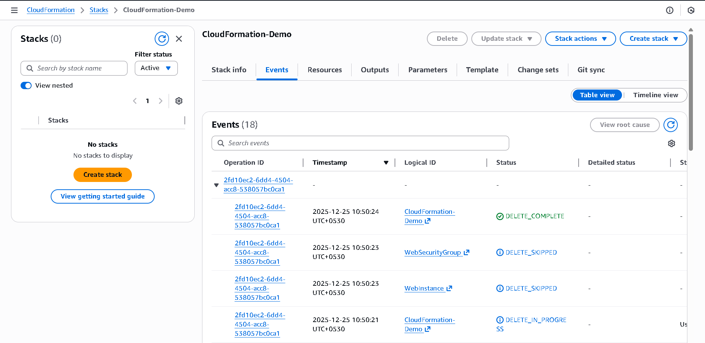

**What's happening:**
- Events show deletion timeline
- WebSecurityGroup: `DELETE_SKIPPED` (due to retention)
- Webinstance: `DELETE_SKIPPED` (due to retention)
- CloudFormation: `DELETE_COMPLETE`
- Stack removed from CloudFormation management

---

### Step 1️⃣5️⃣ — Stacks List (After Deletion)

CloudFormation dashboard showing no active stacks.


**What's happening:**
- Stacks (0) — no active stacks
- "No stacks to display"
- CloudFormation stack completely gone ❌
- **Important:** Resources still exist outside CloudFormation!

---

### Step 1️⃣6️⃣ — EC2 Instance Still Running (The Proof!)

Navigate to EC2 console and verify instance survival.

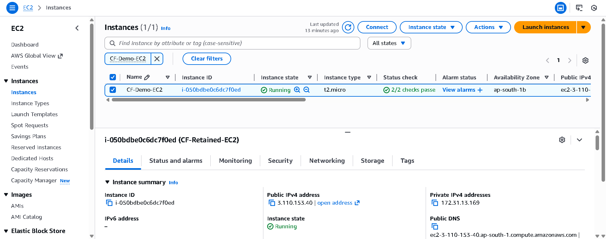

**What's happening:**
- EC2 > Instances shows active instances
- Instance name: `CF-Demo-EC2`
- Instance state: **Running** ✅
- Instance ID: `i-050bdbe0c6dc7f0ed`
- Instance type: `t2.micro`
- Status checks: 2/2 passing
- Public IPv4: `3.110.153.40`
- **Result:** CloudFormation stack deleted, EC2 still running!

---

### Step 1️⃣7️⃣ — Template v1 (Initial - No Retention)

View the initial template without retention policies.


**Key details:**
```yaml
WebSecurityGroup:
  Type: AWS::EC2::SecurityGroup
  # ❌ No DeletionPolicy - will be deleted with stack

Webinstance:
  Type: AWS::EC2::Instance
  # ❌ No DeletionPolicy - will be deleted with stack
```

**Result:** Resources deleted when stack is deleted

---

### Step 1️⃣8️⃣ — Template v2 (Updated - With Retention)

View the updated template with retention policies.


**Key details:**
```yaml
WebSecurityGroup:
  Type: AWS::EC2::SecurityGroup
  DeletionPolicy: Retain              # ✅ Retained
  UpdateReplacePolicy: Retain         # ✅ Protected

Webinstance:
  Type: AWS::EC2::Instance
  DeletionPolicy: Retain              # ✅ Retained
  UpdateReplacePolicy: Retain         # ✅ Protected
```

**Result:** Resources survive when stack is deleted

---

## ✅ Final Outcome Summary

| Component            | Status Before Deletion | Status After Deletion |
| -------------------- | ---------------------- | --------------------- |
| CloudFormation Stack | ✅ Active              | ❌ Deleted            |
| EC2 Instance         | ✅ Running             | ✅ Running            |
| Security Group       | ✅ Exists              | ✅ Exists             |
| Managed by CFN       | ✅ Yes                 | ❌ No                 |

**The Outcome:** Retention policies successfully protected infrastructure from stack deletion.

---

## ⚠️ Important Operational Notes

- **Retained resources are no longer managed by CloudFormation** after stack deletion
- **Cleanup must be done manually** through the AWS console or CLI
- **Retention should be documented** in your team's runbooks
- **Always apply retention before deleting stacks** in production
- **Costs continue** for retained resources (EC2, storage, etc.)
- **Security groups must be manually deleted** to fully remove infrastructure

> Retention is a design decision, not a shortcut.

---

## 🎯 Key Learnings

### What the Workflow Demonstrates

1. **CloudFormation stack creation** is repeatable and safe
2. **Templates can be updated** without resource replacement using change sets
3. **Retention policies** provide a safety net for critical resources
4. **Stack deletion** and resource lifecycle can be decoupled intentionally
5. **Production safety** requires deliberate design choices

### For Production Use

- Always apply retention to **stateful resources**
- Test retention policies in **non-production first**
- Document retained resources in your **team wiki**
- Create **cleanup procedures** before retention is applied
- Use **AWS Config** to track retained resources over time

---

## 💡 Why I Built & Shared This

I'm learning AWS by:

- Practicing real scenarios
- Understanding failure modes
- Documenting safety patterns
- Sharing knowledge openly

This repository reflects **how I think about cloud infrastructure**, not just how I deploy it.

---

## 📚 AWS Documentation References

- [CloudFormation DeletionPolicy](https://docs.aws.amazon.com/AWSCloudFormation/latest/UserGuide/aws-attribute-deletionpolicy.html)
- [UpdateReplacePolicy](https://docs.aws.amazon.com/AWSCloudFormation/latest/UserGuide/aws-attribute-updatereplacepolicy.html)
- [CloudFormation Best Practices](https://docs.aws.amazon.com/AWSCloudFormation/latest/UserGuide/best-practices.html)
- [Stack Resources](https://docs.aws.amazon.com/AWSCloudFormation/latest/UserGuide/aws-properties-stack.html)

---

## 🤝 Let's Connect

If this helped you:

- ⭐ Star the repository
- 💬 Share feedback
- 🔗 Connect with me on LinkedIn

Building cloud infrastructure responsibly 🚀